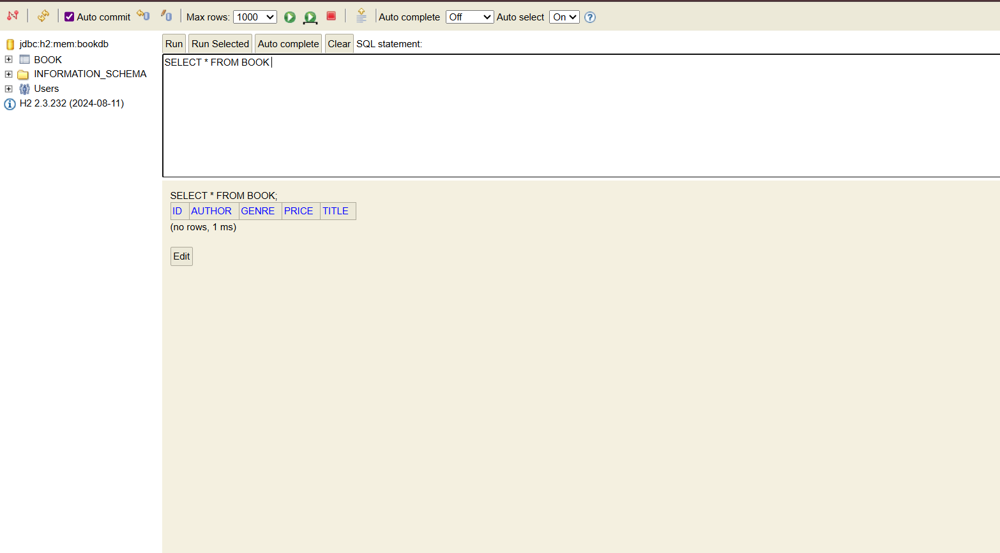
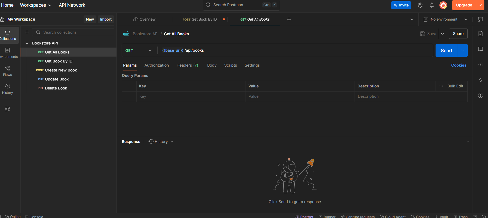

## 📚 Bookstore REST API

A full-featured **Spring Boot REST API** to manage books — including Create, Read, Update, and Delete operations — with integrated **Swagger API docs**, **H2 in-memory DB**, and **Postman collection** for testing.

---

### 🧠 Project Objective

> Design and implement a RESTful API for managing a simple bookstore system that allows clients to perform all CRUD operations via HTTP requests, and interact with it using tools like Postman and Swagger UI.

---

### 🛠️ Tech Stack

| Layer      | Tools Used                     |
| ---------- | ------------------------------ |
| Language   | Java 21                        |
| Framework  | Spring Boot 3.5.3              |
| Database   | H2 (in-memory)                 |
| Build Tool | Maven                          |
| API Docs   | Springdoc OpenAPI (Swagger UI) |
| Testing    | Postman                        |
| IDE        | IntelliJ IDEA                  |

---


## 🗂️ Features

| Feature                                     | Status |
|---------------------------------------------|--------|
| ✅ RESTful CRUD API for Books               | Ready  |
| ✅ JPA Entity mapping & Repository          | Ready  |
| ✅ H2 Database Console [`/h2-console`]      | Ready  |
| ✅ Swagger UI for auto API docs [`/swagger-ui.html`] | Ready  |
| ✅ Postman Collection included              | Ready  |
| ✅ Clean, modular code structure            | Ready  |
| ✅ Runs on `localhost:8081`                 | Ready  |


---

### 📁 API Endpoints

| Method | Endpoint          | Description    |
| ------ | ----------------- | -------------- |
| GET    | `/api/books`      | Get all books  |
| GET    | `/api/books/{id}` | Get book by ID |
| POST   | `/api/books`      | Add a new book |
| PUT    | `/api/books/{id}` | Update a book  |
| DELETE | `/api/books/{id}` | Delete a book  |

---

### 🔗 Swagger Documentation

Access full API documentation here:

```
http://localhost:8081/swagger-ui.html
```

> Built with Springdoc OpenAPI

---

### 🧪 Postman Testing

#### ✅ Steps:

1. Open Postman → Import → Raw Text → Paste Postman collection JSON
2. Set variable `{{base_url}} = http://localhost:8081`
3. Use any of the 5 ready-made endpoints to test

> 💾 Postman Collection: `Bookstore_API.postman_collection.json`

---

### 💻 Run Locally

```bash
# Clone the project
git clone https://github.com/Gulshannadaf/bookstore-api.git

# Open in IntelliJ or run from terminal
mvn spring-boot:run
```

---
## 💾 H2 Database Console

Spring Boot comes pre-configured with an embedded H2 database. You can access the in-memory DB via the H2 web console:

🔗 **URL**: [`http://localhost:8081/h2-console`](http://localhost:8081/h2-console)

### 🛠️ H2 Login Details:

| Setting         | Value                |
|-----------------|----------------------|
| **JDBC URL**    | `jdbc:h2:mem:bookdb` |
| **Username**    | `sa`                 |
| **Password**    | *(leave empty)*      |
| **Driver Class**| `org.h2.Driver` (auto-filled) |

Once connected, you can run SQL queries, browse tables like `BOOK`, and test your data manually.


### 📸 Screenshots

| Swagger UI                          | H2 Console                       | Postman                             |
|-------------------------------------|----------------------------------|-------------------------------------|
|  |  |  |

---

### 📦 Project Structure

```
bookstore-api/
├── controller/
│   └── BookController.java
├── model/
│   └── Book.java
├── repository/
│   └── BookRepository.java
├── application.properties
├── BookstoreApiApplication.java
└── pom.xml
```

---

### 📌 Author

> **Rani Gulshan Nadaf**
> Java Developer | Spring Boot | REST APIs
> [LinkedIn](https://www.linkedin.com/in/rani-gulshan-nadaf-176518268/) • [GitHub](https://github.com/Gulshannadaf)

---


# bookstore-api-springboot

